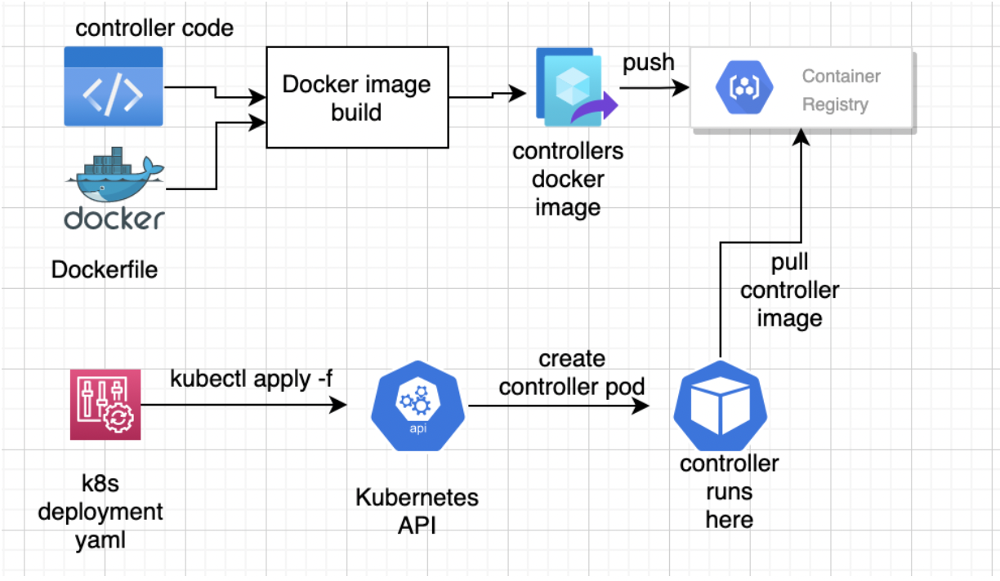

# API Server Operator
 - Learning project to create custom resource, custom controller and write event-driven, eventually  consistent state convergence (reconciliation between desired state and actual state). 
 - This creates a API Server as a custom resource and custom controller deployed to k8s cluster
 - User provides the desired state for API server by passing the namespace in which the API server needs to be provisioned and image version.
 - Custom controller creates/updates deployment and service.
 - It also records events


## Prerequisites
- go version v1.22.0+
- docker version 17.03+.
- kubectl version v1.11.3+.
- Access to a Kubernetes v1.11.3+ cluster.

## Running locally
1. git clone the project to a local directory
2. Make sure docker and kubernetes are either running locally or accessible in case of remote cluster
3. cd into the project directory
4. Install the CRD into the cluster by running:
      ```sh
      make install
      ```
5. To confirm , run the following:
      ```sh
      kubectl get crds
      ```
    You should see `apiservers.quickstart.quickstart.com` being shown in the output
6. Run the controller locally:
      ```sh
      make run
      ```
7. Open `config/samples/quickstart_v1_apiserver.yaml` and replace `namespace` with namespace you have already created or create a namespace and add the value here. Custom resource is provisioned in this namespace
8. Create the custom resource (API Server) by running:
     ```sh
     kubectl apply -f config/samples/quickstart_v1_apiserver.yaml
     ```
9. Observe the output in the terminal where you are running the controller i.e where `make run` is running
   It should be similar to below:
    ```
    2025-01-26T10:42:37Z	INFO	Deployment doesn't exist. Creting new one	{"controller": "apiserver", "controllerGroup": "quickstart.quickstart.com", "controllerKind": "APIServer", "APIServer": {"name":"apiserver-sample","namespace":"genai-agent"}, "namespace": "genai-agent", "name": "apiserver-sample", "reconcileID": "4c45f730-9371-4965-b5fd-6d1c5d0314be"}

    2025-01-26T10:42:37Z	DEBUG	events	Successfully created Deployment	{"type": "Normal", "object": {"kind":"APIServer","namespace":"genai-agent","name":"apiserver-sample","uid":"47ac0b17-ebf3-480f-a62a-72acbd9e832a","apiVersion":"quickstart.quickstart.com/v1","resourceVersion":"1543857"}, "reason": "DeploymentCreated"}

    2025-01-26T10:51:20Z	INFO	Service doesn't exist. Creting new one	{"controller": "apiserver", "controllerGroup": "quickstart.quickstart.com", "controllerKind": "APIServer", "APIServer": {"name":"apiserver-sample","namespace":"genai-agent"}, "namespace": "genai-agent", "name": "apiserver-sample", "reconcileID": "4c45f730-9371-4965-b5fd-6d1c5d0314be"}

    2025-01-26T10:51:21Z	DEBUG	events	Successfully created Service	{"type": "Normal", "object": {"kind":"APIServer","namespace":"genai-agent","name":"apiserver-sample","uid":"47ac0b17-ebf3-480f-a62a-72acbd9e832a","apiVersion":"quickstart.quickstart.com/v1","resourceVersion":"1543857"}, "reason": "ServiceCreated"}

    2025-01-26T10:51:21Z	DEBUG	events	Successfully reconciled API Server	{"type": "Normal", "object": {"kind":"APIServer","namespace":"genai-agent","name":"apiserver-sample","uid":"47ac0b17-ebf3-480f-a62a-72acbd9e832a","apiVersion":"quickstart.quickstart.com/v1","resourceVersion":"1543857"}, "reason": "Reconciled"}
    ```
10. Do port forwarding to access the API at `http://localhost:<port>/version`. You should see an output as below:
    ```json
    {
        "version": "1.0.1",
        "replica" : "<pod id>"
    }
    ```
11. At this stage, you have successfully created the custom resource and controller completed reconciliation to deploy the API server in user provided namespace
12. Lets now see the update in action
13. Open `config/samples/quickstart_v1_apiserver.yaml` and replace `version` under `spec` with new value: `1.0.2`
14. Apply the new changes by running:
    ```sh
    kubectl apply -f config/samples/quickstart_v1_apiserver.yaml
    ```
15. Since the desired state has deviated from actual state, controller reconciles the state and updates the deployment. Observe the output in the terminal where you are running the controller i.e where `make run` is running. It should be similar to below:
    ```
    2025-01-26T10:56:08Z	INFO	Read API Server	{"controller": "apiserver", "controllerGroup": "quickstart.quickstart.com", "controllerKind": "APIServer", "APIServer": {"name":"apiserver-sample","namespace":"genai-agent"}, "namespace": "genai-agent", "name": "apiserver-sample", "reconcileID": "122e0be2-dbc5-4f0e-a416-e8a24ec54411", "version": "1.0.2", "namespace": "genai-agent"}

    2025-01-26T10:56:08Z	INFO	Deployment exists	{"controller": "apiserver", "controllerGroup": "quickstart.quickstart.com", "controllerKind": "APIServer", "APIServer": {"name":"apiserver-sample","namespace":"genai-agent"}, "namespace": "genai-agent", "name": "apiserver-sample", "reconcileID": "122e0be2-dbc5-4f0e-a416-e8a24ec54411", "deployment": "api-server-deployment"}

    2025-01-26T10:56:08Z	INFO	Service exists. Updating...	{"controller": "apiserver", "controllerGroup": "quickstart.quickstart.com", "controllerKind": "APIServer", "APIServer": {"name":"apiserver-sample","namespace":"genai-agent"}, "namespace": "genai-agent", "name": "apiserver-sample", "reconcileID": "122e0be2-dbc5-4f0e-a416-e8a24ec54411", "service": "api-server-service"}

    2025-01-26T10:56:08Z	DEBUG	events	Successfully updated Deployment	{"type": "Normal", "object": {"kind":"APIServer","namespace":"genai-agent","name":"apiserver-sample","uid":"47ac0b17-ebf3-480f-a62a-72acbd9e832a","apiVersion":"quickstart.quickstart.com/v1","resourceVersion":"1552613"}, "reason": "DeploymentUpdated"}

    2025-01-26T10:56:08Z	DEBUG	events	Successfully updated Service	{"type": "Normal", "object": {"kind":"APIServer","namespace":"genai-agent","name":"apiserver-sample","uid":"47ac0b17-ebf3-480f-a62a-72acbd9e832a","apiVersion":"quickstart.quickstart.com/v1","resourceVersion":"1552613"}, "reason": "ServiceUpdated"}

    2025-01-26T10:56:08Z	DEBUG	events	Successfully reconciled API Server	{"type": "Normal", "object": {"kind":"APIServer","namespace":"genai-agent","name":"apiserver-sample","uid":"47ac0b17-ebf3-480f-a62a-72acbd9e832a","apiVersion":"quickstart.quickstart.com/v1","resourceVersion":"1552613"}, "reason": "Reconciled"}
    ```
 16. Do port forwarding to access the API at `http://localhost:<port>/version`. You should see an output as below:
    ```json
    {
        "version": "1.0.2",
        "replica" : "<pod id>"
    }
    ```
 17. At this stage, you have successfully updated the custom resource and controller completed reconciliation to update the API server in user provided namespace
 18. Lets now see the delete in action. When creating the deployment and service, we have made the API Server as an owner of these 2 resources. Therefore, when the API Server resource is deleted, Kubernetes deletes the owned resources as well. Also we have added finalizer to the controller to understand how that works. Run the below command to delete the custom resource:
    ```sh
    kubectl delete apiservers <name> -n <namespace>
    ```
 19. Observe the output in the terminal where you are running the controller i.e where `make run` is running. It should be similar to below:
    ```
    2025-01-27T04:00:46Z	INFO	Read API Server	{"controller": "apiserver", "controllerGroup": "quickstart.quickstart.com", "controllerKind": "APIServer", "APIServer": {"name":"apiserver-sample","namespace":"genai-agent"}, "namespace": "genai-agent", "name": "apiserver-sample", "reconcileID": "98b571c0-9324-4bad-a632-350d4f0cb990", "version": "1.0.4", "namespace": "genai-agent"}

    2025-01-27T04:00:46Z	INFO	Doing resource cleanup....	{"controller": "apiserver", "controllerGroup": "quickstart.quickstart.com", "controllerKind": "APIServer", "APIServer": {"name":"apiserver-sample","namespace":"genai-agent"}, "namespace": "genai-agent", "name": "apiserver-sample", "reconcileID": "98b571c0-9324-4bad-a632-350d4f0cb990"}

    2025-01-27T04:00:56Z	INFO	Resource cleanup complete.	{"controller": "apiserver", "controllerGroup": "quickstart.quickstart.com", "controllerKind": "APIServer", "APIServer": {"name":"apiserver-sample","namespace":"genai-agent"}, "namespace": "genai-agent", "name": "apiserver-sample", "reconcileID": "98b571c0-9324-4bad-a632-350d4f0cb990"}

    2025-01-27T04:00:56Z	INFO	AP Server resource not found. May be removed	{"controller": "apiserver", "controllerGroup": "quickstart.quickstart.com", "controllerKind": "APIServer", "APIServer": {"name":"apiserver-sample","namespace":"genai-agent"}, "namespace": "genai-agent", "name": "apiserver-sample", "reconcileID": "02f04e2a-0394-4d8c-aafe-e2b9357df274"}
    ```
 20. We have seen the whole lifecycle of a custom resource and how reconciliation happens at each stage


## Deploying on the cluster
We have seen how to install the CRDs and run the controllers locally for development purposes. We did `make install` to install the CRDs into the local cluster, `make run` to run and debug the controller locally. In this section, we will see how to deploy and run the CRD and controller on a remote cluster.

Before we get into the deployment details, some important concepts to understand:
1. Custom Controllers are run as normal application workloads on Kubernetes's data plane as pods.
2. So we need to create a docker image from the go code
3. Create a deployment using the above docker image
4. Apply the deployment on the cluster

> **Note:** To ensure you start from a clean slate, do the following:
> 1. Ensure there are no custom resources created in the cluster
> 2. If there are any custom resources, delete them. Ensure you are running the controller using `make run` and then delete
> 3. Run make uninstall to Uninstall CRDs from the K8s cluster specified in `~/.kube/config`.

### Deployment Process
The deployment process is as shown below:


1. Build the controller image
    - `make docker-build IMG=<your-docker-image>`
    - Replace `<your-docker-image>` with the full image name (e.g., myrepo/mycontroller:latest).
    - `Dockerfile` is available as part of the kubebuilder project
2. Push the image to a registry
    - `make docker-push IMG=<your-docker-image>`
3. Update the Deployment YAML
    - Edit the `config/manager/manager.yaml` file to use your image:
        ```yaml
        spec:
		    containers:
			  image: quickstart-operator-image:0.0.1
              name: quickstart-operator
4. Generate and apply the required Kubernetes resources:
    - `make install` : Install CRDs into the K8s cluster specified in `~/.kube/config`
    - `kubectl apply -k config/default`
        - Applies the Kustomization:
		    - `config/default` is typically the directory where the Kustomize configuration (kustomization.yaml) for your controller resides.
			- Combines the necessary YAML files (e.g., RBAC, CRDs, and the manager deployment) and applies them to the Kubernetes cluster.
		- Deploys the Controller:
            - This command will deploy the manager (the Deployment for your controller) and any other resources defined in the config/default directory.
    - Controller resources are deployed in a namespace configured in `config/default/kustomization.yaml`
        ```yaml
        # Adds namespace to all resources.
        namespace: quickstart-operator-system
5. Run: `kubectl get pods -n quickstart-operator-system` to see the resources created
    

6. Create a custom resource: `kubectl apply -f config/samples/quickstart_v1_apiserver.yaml -n <namespace>`
7. To view controller logs: `kubectl logs -n <namespace> <controller-pod-name>`, where
     - `<namespace>`: where the controller resources are created as in above step
     - `<controller-pod-name>`: pod where the controller is running.

### To Uninstall
**Delete the instances (CRs) from the cluster:**

```sh
kubectl delete -k config/samples/
```

**Delete the APIs(CRDs) from the cluster:**

```sh
make uninstall
```

**UnDeploy the controller from the cluster:**

```sh
make undeploy
```

## Project Distribution

Following are the steps to build the installer and distribute this project to users.

1. Build the installer for the image built and published in the registry:

```sh
make build-installer IMG=<some-registry>/quickstart-operator:tag
```

NOTE: The makefile target mentioned above generates an 'install.yaml'
file in the dist directory. This file contains all the resources built
with Kustomize, which are necessary to install this project without
its dependencies.

2. Using the installer

Users can just run kubectl apply -f <URL for YAML BUNDLE> to install the project, i.e.:

```sh
kubectl apply -f https://raw.githubusercontent.com/<org>/quickstart-operator/<tag or branch>/dist/install.yaml
```


## Debugging controller locally
Its always great to be able to debug an application and more so for a complex piece like a controller. This section describes how to debug controllers in Visual Studio Code
- Open project in VS Code
- Click on "Run" button in the left sidebar
    
- This opens the window as shown below:
    
- Click on "create a launch json file"
- Select the below option:
    
- This creates a `launch.json` file under `.vscode` folder.
- Replace the content with the below content:
  ```json
  		{
		    "version": "0.2.0",
		    "configurations": [
		        {
		            "name": "Launch Package",
		            "type": "go",
		            "request": "launch",
		            "mode": "debug",
		            "program": "${workspaceFolder}/cmd/main.go"
		        }
		    ]
        }
- Open controller and place a breakpoint in Reconcile function
    
- Go to Run -> Start Debugging
- Watch for logs in Debug Console
- After some time, the breakpoint should be hit
    

> **Note:** If you face an error such as: Version of Delve is too old for this version of Go (maximum supported version `1.16`, suppress this error with `--check-go-version=false`) version of Delve (the Go debugger) installed on your system is not compatible with your current version of Go.
> - The error message suggests that Delve supports Go versions up to `1.16`, but you're likely using a newer version of Go. To resolve this, you'll need to update `Delve` to a version that supports your Go version. Here's how to do that:
    `go install github.com/go-delve/delve/cmd/dlv@latest`
> - Once Delve is updated, you can try running the VS Code debugger again. The error should no longer appear.
